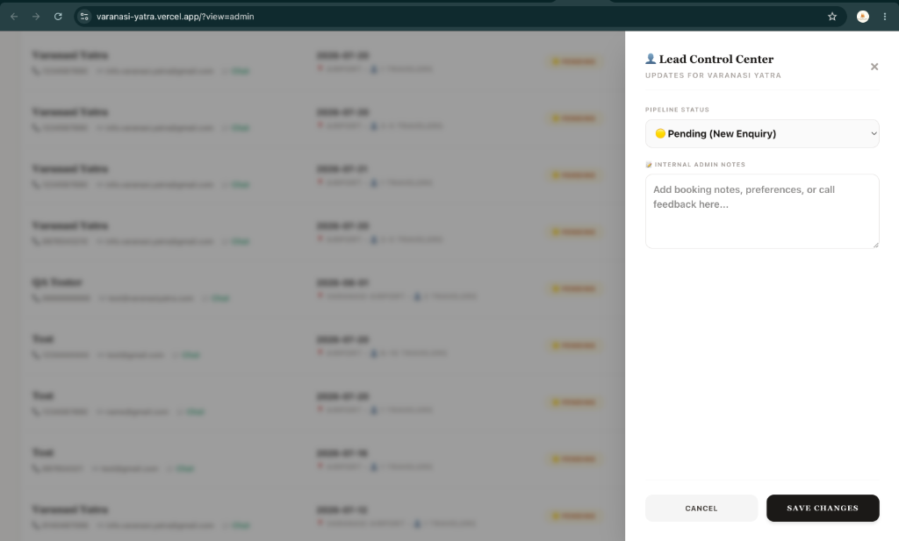
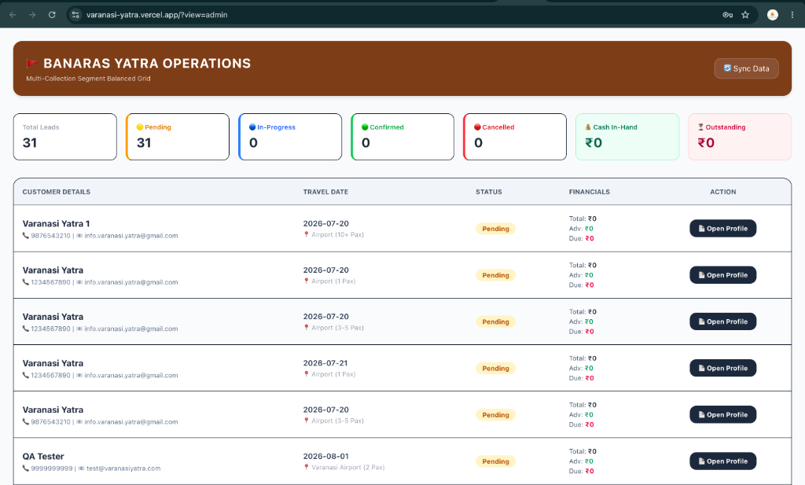
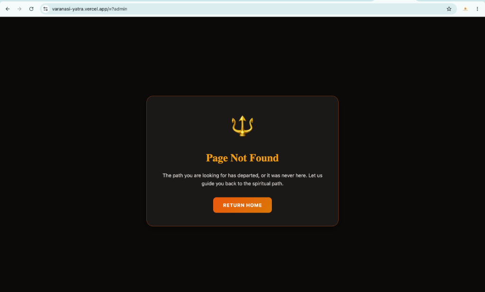

# Banaras Yatra Operations 🚩 (v1.0.0 Release)

A premium, commercial-grade travel CRM and customer portal designed for **Banaras Yatra**, a travel agency specializing in customized pilgrimages and sightseeing tours across Varanasi, Ayodhya, Bodh Gaya, Chunar, Mirzapur, and Nepal.

This repository hosts both the SEO-optimized customer portal and the unified **Banaras Yatra Operations** SaaS-style CRM.

---

## 📸 Visual Showcases & Screenshots

### 🖥️ 1. SaaS Admin CRM Dashboard (Version 1.0)
A premium, Stripe-inspired operations control center containing real-time analytics, dynamic status metric filters, a fast search bar, interactive customer actions (call, email, quick WhatsApp chat), and inline profile editing.


### ➕ 2. Offline Manual Booking Entry Drawer
Allows operators to record telephone inquiries, walk-ins, and WhatsApp bookings. Features custom datepickers, passenger counts, and automatic outstanding balance calculations (Package Cost - Advance Paid) if the status is set to *Confirmed*.


### ✉️ 3. Premium Customer Confirmation Receipts
HTML receipts triggered automatically on confirmed bookings, highlighting payment status, travel date, pickup point, and due payments in an easy-to-read, formatted format.


---

## 🚀 Key Features

*   **World-Class Varanasi Destination Page:** Detailed sightseeing guide of 10 primary attractions, sample timelines, local food guides, shopping coordinates, and 20 detailed tourist FAQs.
*   **Unified CRM & Pipeline Manager:** auth-guarded via passcode verification (`1234` by default) to let operators monitor total, pending, in-progress, confirmed, and cancelled bookings.
*   **CRO Optimized Forms:** Pre-fills WhatsApp API message intents, handles automated field validations, and returns responsive, formatted customer notices.
*   **Automated Email Notifications:** NodeMailer integration on local & serverless endpoints that dispatches high-quality, formatted alert emails to admin on new bookings, and confirmation receipts to customers.
*   **Security & Compliance:** Custom rate-limiters (`express-rate-limit`) implemented on sensitive endpoints (PIN verification, booking creations) to prevent spam.
*   **React 19 Native SEO Hoisting:** Updates title headers, canonical links, and schemas (`TouristTrip` and `BreadcrumbList` JSON-LD data) for crawl optimization.
*   **Clean and Robust Codebase:** Fully audited via `oxlint` with zero warnings or errors.

---

## 🛠️ Technology Stack

- **Frontend Framework:** React 19, Vite, React Router v6, Tailwind CSS
- **Local Runner:** Node.js, Express.js
- **Production Infrastructure:** Firebase Cloud Functions (Gen 2 Node.js 22), Firebase Hosting (Vite builds), MongoDB Atlas (Cloud Database)

---

## 📂 Project Architecture

```bash
├── backend/
│   ├── functions/             # Firebase Cloud Functions (Production backend)
│   │   ├── index.js           # Serverless API routes & rate limiters
│   │   └── package.json
│   ├── server.js              # Local Express development server
│   └── .env                   # Environment credentials
├── public/
│   ├── screenshots/           # Release screenshots
│   ├── sitemap.xml            # Dynamic SEO sitemap
│   └── robots.txt             # Search crawler directives
└── src/
    ├── assets/                # Local landscape and branding media
    ├── components/
    │   ├── SEO.jsx            # Dynamic metadata injector
    │   ├── BookingForm.jsx    # Secure leads capture form
    │   ├── VaranasiDestination.jsx # Interactive Varanasi itinerary planner
    │   └── AdminCRM.jsx       # Auth-guarded transaction control center
    ├── App.jsx                # Layout routes configuration
    └── main.jsx
```

---

## 💻 Local Development Setup

### 1. Backend API Server
Navigate to the backend directory, install packages, and boot the server:
```bash
cd backend
npm install
node server.js
```
*API will listen at `http://localhost:5001`.*

### 2. Frontend Development Server
From the root workspace folder, boot the Vite client:
```bash
npm install
npm run dev
```
*Vite client will listen at `http://localhost:5173`. Access `http://localhost:5173/?view=admin` to open the Operations CRM.*

---

## 📦 Production Bundling & Linting
Enforce code quality standards and generate optimized client assets:
```bash
# Code linter check
npm run lint

# Production compiler build
npm run build
```
Optimized assets will output inside `/dist`, ready for direct deployment.
