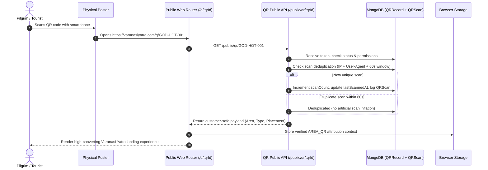

# Varanasi Yatra Dynamic QR Network — Architecture & Operations Guide

## Executive Overview
The **Varanasi Yatra Dynamic QR Network** (Prompt 4) introduces an operational, zero-code QR physical network management platform. It allows the CEO and authorized managerial roles to dynamically orchestrate physical QR placements across the city of Varanasi (and expansion territories), track real-time scans, enforce server-validated lead attribution (`AREA_QR`), seamlessly attribute bookings and revenue, and manage the full physical lifecycle (draft, generated, installed, active, damaged, replaced, deactivated) without modifying any source code.

---

## 1. Area Model
The `Area` represents a distinct geographic region, neighborhood, or hub within Varanasi (e.g., Godaulia, Assi Ghat, Cantonment, Sarnath, Dashashwamedh).

### Data Schema (`backend/modules/qr/qrModels.js`)
```javascript
{
  name: { type: String, required: true, trim: true },
  code: { type: String, required: true, unique: true, uppercase: true, trim: true },
  description: { type: String, default: '' },
  status: { type: String, enum: ['ACTIVE', 'INACTIVE'], default: 'ACTIVE' },
  allowedQrTypes: [{
    type: String,
    enum: ['HOTEL', 'PAID_PLACEMENT', 'PUBLIC_PLACE', 'ROADSIDE']
  }],
  notes: { type: String, default: '' },
  createdAt: { type: Date, default: Date.now },
  updatedAt: { type: Date, default: Date.now }
}
```

### Dynamic Scope Rule
Each area defines **ONLY** the QR types actually permitted and required in that territory. There is no rigid global category list enforced across all areas. For example:
- **Godaulia (`GOD`)**: `['HOTEL', 'PAID_PLACEMENT', 'PUBLIC_PLACE', 'ROADSIDE']`
- **Lanka (`LNK`)**: `['HOTEL', 'PUBLIC_PLACE']`
- **Sarnath (`SRN`)**: `['HOTEL', 'ROADSIDE']`

The CEO configures these permissions dynamically through the CRM. Attempting to provision a QR token whose type is not permitted for that area is rejected server-side with HTTP 400.

---

## 2. Controlled QR Types vs. Physical Placement Model
To prevent taxonomy explosion and maintenance paralysis, QR types are kept strictly canonical:

| Canonical Type | Operational Meaning | Placement Details (Free Text) |
| :--- | :--- | :--- |
| `HOTEL` | Hotel lobby, reception counter, guest room tent card | *"Hotel Ganges View entrance lobby"* |
| `PAID_PLACEMENT` | Commercial shop, café counter, restaurant billing desk | *"Blue Lassi Shop counter near billing"* |
| `PUBLIC_PLACE` | Ghat notice board, temple plaza standee, transit kiosk | *"Dashashwamedh Ghat public notice board"* |
| `ROADSIDE` | Roadside tea stall, rickshaw stand point, intersection pillar | *"Main road tea cart opposite crossing"* |

Nested operational subtypes (such as `ROADSIDE_POLE`, `ROADSIDE_CART`, `ROADSIDE_WALL`) are avoided. Instead, `placementName` or `placementDetails` stores free-form descriptive text.

---

## 3. QR Status vs. Installation Status
**A QR Type is NEVER a QR Status.** Statuses represent lifecycle phases:

### QR Statuses (`QR_STATUSES`)
- `DRAFT`: Token allocated in CRM, metadata defined, not yet generated into physical artwork.
- `GENERATED`: High-resolution vector QR code rendered and ready for printing.
- `INSTALLED`: Placed on-site by field team, awaiting final operational verification.
- `ACTIVE`: Fully operational, scanning recorded, attribution live.
- `DAMAGED`: Poster torn, faded, defaced, or physically compromised. (*Damaged is a status, never a QR type.*)
- `MISSING`: Poster removed, stolen, or untraceable on field audit.
- `REPLACEMENT_PENDING`: CEO/Manager triggered replacement; replacement token generated.
- `REPLACED`: Successfully superseded by a new unique QR token; preserved historically.
- `INACTIVE`: Permanently or temporarily deactivated by CEO.

### Installation Statuses (`INSTALLATION_STATUSES`)
- `PENDING`: Not yet deployed in the field.
- `INSTALLED`: Verified and affixed on site.
- `REMOVED`: Taken down or retired.

---

## 4. Unique QR Token Generation & Lifecycle

### Atomic Sequential Token Allocation
Each physical QR poster receives a cryptographically unique, human-readable identifier formatted as:
$$\text{AREA} - \text{CATEGORY} - \text{SEQUENCE}$$

Examples:
- `GOD-HOT-001` (Godaulia Hotel #1)
- `GOD-PAID-001` (Godaulia Paid Placement #1)
- `ASSI-PUB-001` (Assi Ghat Public Place #1)
- `SRN-ROAD-001` (Sarnath Roadside #1)

Allocation is atomic and calculated server-side from the existing database records (`MAX(sequence) + 1`), ensuring zero race conditions. Sequence numbers are never accepted from the frontend.

### Damage & Replacement Workflow
When a physical poster is damaged:
1. Manager or CEO marks `GOD-ROAD-001` as `DAMAGED`.
2. The user initiates **Create Replacement** in the CRM.
3. The system generates `GOD-ROAD-002`:
   - `replacementOf = 'GOD-ROAD-001'`
   - `status = 'DRAFT'` or `'GENERATED'`
4. The old record `GOD-ROAD-001`:
   - `status = 'REPLACED'`
   - `replacedBy = 'GOD-ROAD-002'`
   - **Historical record is never deleted** — all past scans, leads, and bookings remain intact.
5. If an old damaged QR is scanned before field replacement, the public router can gracefully redirect visitors to the active replacement token (`redirected: true, targetQrId: 'GOD-ROAD-002'`).

---

## 5. Permission Tracking
Physical public placements (`PUBLIC_PLACE`, `ROADSIDE`) often require local permissions (municipal, vendor, or property owner):
- `permissionStatus`: `PENDING`, `REQUESTED`, `APPROVED`, `REJECTED`, `NOT_REQUIRED`
- **Enforcement Rule**: A QR record in `PUBLIC_PLACE` or `ROADSIDE` whose `permissionStatus` is `PENDING` or `REJECTED` **cannot be activated or marked as installed** until explicitly updated to `APPROVED` or `NOT_REQUIRED`.

---

## 6. Public QR Scan Flow & Deduplication



### Server-Side Deduplication
To prevent refresh spamming or rapid duplicate scans from inflating analytics, the backend logs each scan in `qrscans` and checks whether the same client (hashed IP and User-Agent) scanned that exact `qrId` within the last 60 seconds. Duplicate scans are acknowledged without incrementing `scanCount`.

---

## 7. Lead & Booking Attribution

### Lead Submission Integration
When the user submits an enquiry via the Quick Trip Planner or contact modal:
1. Client submits: `source = 'AREA_QR'`, `qrId = 'GOD-HOT-001'`, `areaId = '...'`.
2. Backend validation (`backend/server.js`):
   - Validates that `qrId` exists and is `ACTIVE` (or redirects if replaced).
   - Resolves authentic `areaId`, `areaName`, `qrType`.
   - Constructs an immutable snapshot:
     ```javascript
     enquiry.source = 'AREA_QR';
     enquiry.qrId = qr.qrId;
     enquiry.areaId = qr.areaId;
     enquiry.areaName = qr.areaName;
     enquiry.qrType = qr.qrType;
     enquiry.qrAttribution = {
       qrId: qr.qrId,
       areaId: String(qr.areaId),
       areaName: qr.areaName,
       qrType: qr.qrType,
       capturedAt: new Date()
     };
     ```
   - Increments `QRRecord.leadCount` atomically.
   - If `qrId` is invalid or tampered with, lead gracefully defaults to `source = 'WEBSITE'` with null QR attribution.

### Booking & Revenue Attribution
When a quote converts into a finalized `Booking`:
1. The booking inherits the lead's verified `source`, `qrId`, `areaId`, `areaName`, and `qrType`.
2. The booking final selling price is added to `QRRecord.revenueGenerated`.
3. `QRRecord.bookingCount` is incremented.
4. Historical revenue remains permanent even if the physical QR is later damaged or retired.

---

## 8. Hotel Partner QR Compatibility (`HOTEL_QR`)
Existing hotel partner QR flows remain **100% operational**:
- `HOTEL_QR`: Driven by partner codes (e.g., `brijrama`, `taj_ganges`), feeds partner revenue share and partner attribution.
- `AREA_QR`: Driven by geographic area codes (e.g., `GOD-HOT-001`), feeds territorial QR network analytics.
- If a hotel QR also has a designated partner, `partnerId` is optionally recorded on `QRRecord` without breaking the legacy partner portal.

---

## 9. Role-Based Access Control & Financial Privacy

| Role | Area Management | QR Provisioning | Installation Operations | QR Performance Analytics | Revenue Figures |
| :--- | :---: | :---: | :---: | :---: | :---: |
| **CEO** | Full CRUD | Generate, Replace, Deactivate | Full | Full Network & Area breakdowns | **Full (₹)** |
| **Manager** | View Only | View Assigned QRs | Mark Installed, Update Status | Operational counts (Scans, Leads, Bookings) | **Strictly Redacted** |
| **Team Leader** | Blocked (403) | Blocked (403) | View assigned field tasks | Team-scoped lead attribution | **Strictly Redacted** |
| **Team Member**| Blocked (403) | Blocked (403) | Blocked | Minimal operational attribution | **Strictly Redacted** |
| **Public Visitor**| Blocked (403) | Blocked (403) | Blocked | Blocked | **Strictly Redacted** |

**Zero Financial Leakage Guarantee**: Vendor costs, company margins, expected profit, and CEO internal notes are strictly stripped from all manager, team, and public API responses.

---

## 10. API Specifications

### Area Management (`/admin/qr/areas`)
- `GET /admin/qr/areas`: List all areas with aggregated statistics (`totalQrs`, `activeQrs`, `damagedQrs`, `totalLeads`, `totalBookings`).
- `POST /admin/qr/areas`: Create area (CEO only). Validates name, unique uppercase code, and allowed types.
- `GET /admin/qr/areas/:id`: Get area details and allowed types.
- `PATCH /admin/qr/areas/:id`: Update area metadata and allowed types (CEO only).
- `PATCH /admin/qr/areas/:id/status`: Activate or deactivate an area (CEO only).

### QR Token Management (`/admin/qr`)
- `GET /admin/qr`: Cross-network QR records list with filtering by `areaId`, `qrType`, `status`, and text search.
- `POST /admin/qr`: Provision new QR (CEO only). Validates that `qrType` is in `area.allowedQrTypes`.
- `GET /admin/qr/:qrId`: Retrieve detailed QR record, lifecycle history, and attribution metrics.
- `POST /admin/qr/:qrId/generate`: Transition from `DRAFT` to `GENERATED`.
- `POST /admin/qr/:qrId/install`: Mark as installed. Requires permission approval for public/roadside locations.
- `POST /admin/qr/:qrId/damage`: Mark as damaged with damage reason.
- `POST /admin/qr/:qrId/replace`: Allocate next sequential token, mark old token `REPLACED`, link replacement pointers.
- `POST /admin/qr/:qrId/deactivate`: Deactivate QR token.

### Analytics Endpoints (`/admin/qr/analytics`)
- `GET /admin/qr/analytics`: Executive overview with KPI cards, conversion funnel, area breakdown, and QR type breakdown. Aggregated server-side via MongoDB `$facet` and `$group`.
- `GET /admin/qr/analytics/areas/:areaId`: Detailed breakdown for a single area.

### Public Endpoints (`/public/qr`)
- `GET /public/qr/:qrId`: Public QR resolution. Logs scan, checks replacement redirection, returns safe branding payload.
- `POST /public/qr/:qrId/scan`: Beacon endpoint for client-side scan confirmation.
- `POST /public/leads`: Lead intake with verified `AREA_QR` server-side token validation.

---

## 11. Database Indexes
High-frequency schemas have compound indexes to eliminate full-collection scans:
```javascript
// QRRecord
{ qrId: 1 } (Unique)
{ areaId: 1, status: 1 }
{ areaId: 1, qrType: 1, status: 1 }
{ lastScannedAt: -1 }

// QRScan (TTL auto-cleanup)
{ qrId: 1, scannedAt: -1 }
{ clientHash: 1, qrId: 1, scannedAt: -1 }

// Enquiry
{ source: 1, qrId: 1, createdAt: -1 }

// Booking
{ source: 1, qrId: 1, createdAt: -1 }
```
